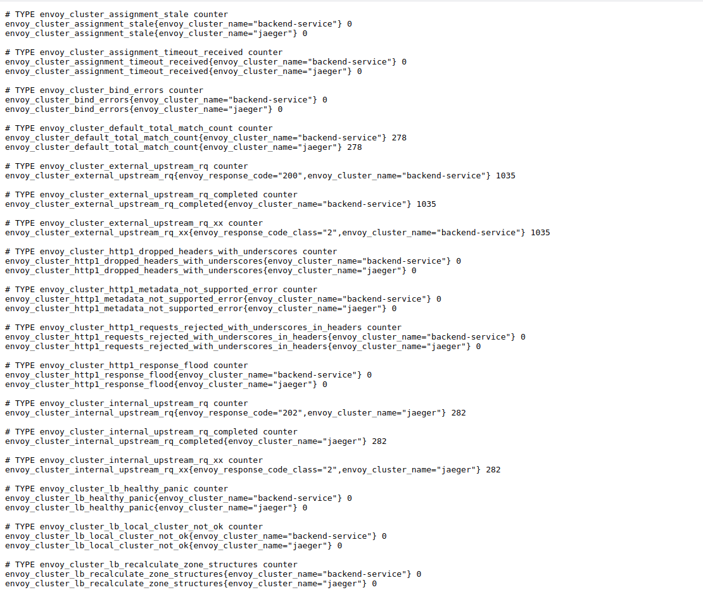
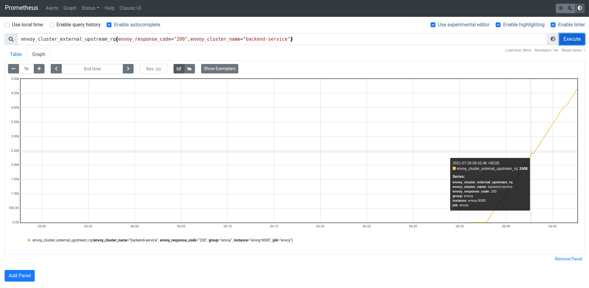
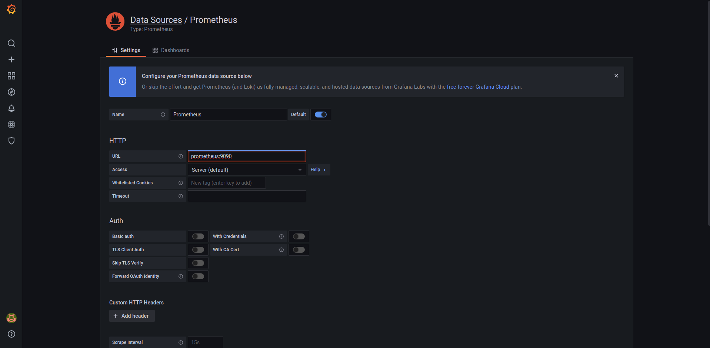
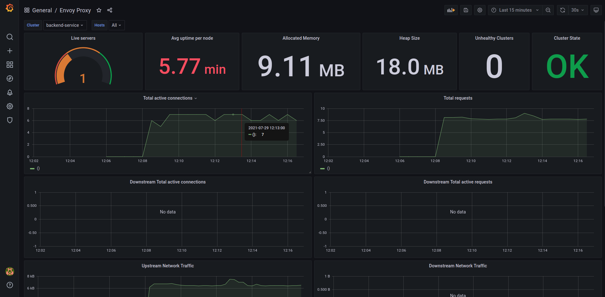
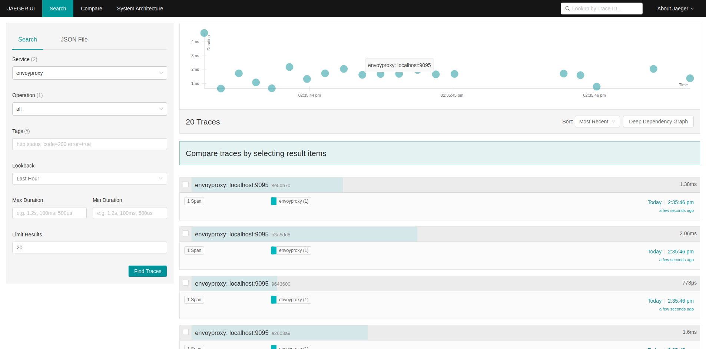

## Envoyproxy metrics and observability with prometheus, grafana and jaeger.

### About

In this setup, metrics and observability aspects of envoy proxy will be demonstrated using prometheus, grafana and jaeger.

### Envoy statistics

One of the primary goals of Envoy is to make the network understandable. Envoy emits a large number of statistics depending on how it is configured. Generally the statistics fall into three categories:

* Downstream: Downstream statistics relate to incoming connections/requests. They are emitted by listeners, the HTTP connection manager, the TCP proxy filter, etc.

* Upstream: Upstream statistics relate to outgoing connections/requests. They are emitted by connection pools, the router filter, the TCP proxy filter, etc.

* Server: Server statistics describe how the Envoy server instance is working. Statistics like server uptime or amount of allocated memory are categorized here.

Envoy has the ability to support custom, pluggable sinks like statsd, hystrix , dog_statsd etc. But for our scenario we are directly fetching the statistics using prometheus since envoy has out of the box prometheus integration.

### Running the setup

> Prerequisites: docker, docker-compose

In this setup, 4 services are used to demonstrate the metrics and observability aspects.

1. Envoy proxy instance that routes the requests to the back end service.
2. Mock backend service which sends the request information to the client.
3. Prometheus instance that pulls metrics from envoy.
4. Grafana dashboard instance that displays the metrics collected in prometheus.
5. Jaeger instance that collects zipkin traces and display tracing information.

To run the setup execute,

```sh
docker-compose up
```

Send a sample request and see whether everything is working,

```sh
curl localhost:9095/api/v1/3scale-metrics
```
Response received from the above,

```sh
{
  "path": "/api/v1/3scale-metrics",
  "headers": {
    "host": "localhost:9095",
    "user-agent": "curl/7.68.0",
    "accept": "*/*",
    "x-forwarded-proto": "http",
    "x-request-id": "b5d5ddc2-dc1d-94ff-87a3-0898ae5ce107",
    "x-envoy-expected-rq-timeout-ms": "15000",
    "x-b3-traceid": "7115ed420c08df3d",
    "x-b3-spanid": "7115ed420c08df3d",
    "x-b3-sampled": "1"
  },
  "method": "GET",
  "body": "",
  "fresh": false,
  "hostname": "localhost",
  "ip": "::ffff:172.22.0.2",
  "ips": [],
  "protocol": "http",
  "query": {},
  "subdomains": [],
  "xhr": false,
  "os": {
    "hostname": "1fc38387ef32"
  }
}%            
```

> Note: You can try any path that instead of the above.

For the rest of the section follow the following steps.

### 1. Send continous requests to visualize the metrics.

To visualize the metrics start sending continous requests using,

```sh
while true; do curl localhost:9095/test123; sleep .1; done
```
### 2. Prometheus metrics in envoy using admin interface.

Go to `localhost:9000/stats/prometheus` to see all the metrics in the prometheus compatiable format.



### 3. Quering the metrics using prometheus.

1. Go to `localhost:9090` and you will see the prometheus dashbaord.
2. Copy any of the metrics from the `stats/prometheus` and execute the query in the prometheus dashboard. For example use the metric, `envoy_cluster_external_upstream_rq{envoy_response_code="200",envoy_cluster_name="backend-service"}` to see the total 200 response codes for cluster backend-service.
3. You will see the response to the query as follows. Also if you select the graph tab from the tabpane, you can see some visulization for the queried metric.


### 4. Configuring grafana and adding a datasource.

1. Go to `localhost:3000` and enter default username and password of prometheus. (username: admin & password: admin)
2. Skip the additional new password setup. 
3. From the dashboard choose `Add your first data source` button in the `data sources` tab.
4. Select prometheus from the datasources list.
5. Add the value `prometheus:9090` for the HTTP URL input field. Scroll down and click the `Save & test` button. You should see a pop up saying `Data source is working` if the data source is successfully added.

6. Next click on the `+` button in the left side panel and select `import`.
7. For this setup we are using an already available grafana dashbaord for envoy proxy. In the form enter `6693` to the `Import via grafana.com` input field and click the `load` next to the input field.
8. Select prometheus data source from the drop down.
9. If everything is working as expected, you should see a grafana dashboard like follows.


### 5. Tracing with jaeger

1. Go to `localhost:16686/` to open the jaeger dashboard. 
2. Choose the service as `envoyproxy` if it is not already selected.
3. Click on the trace button to see the traces.



